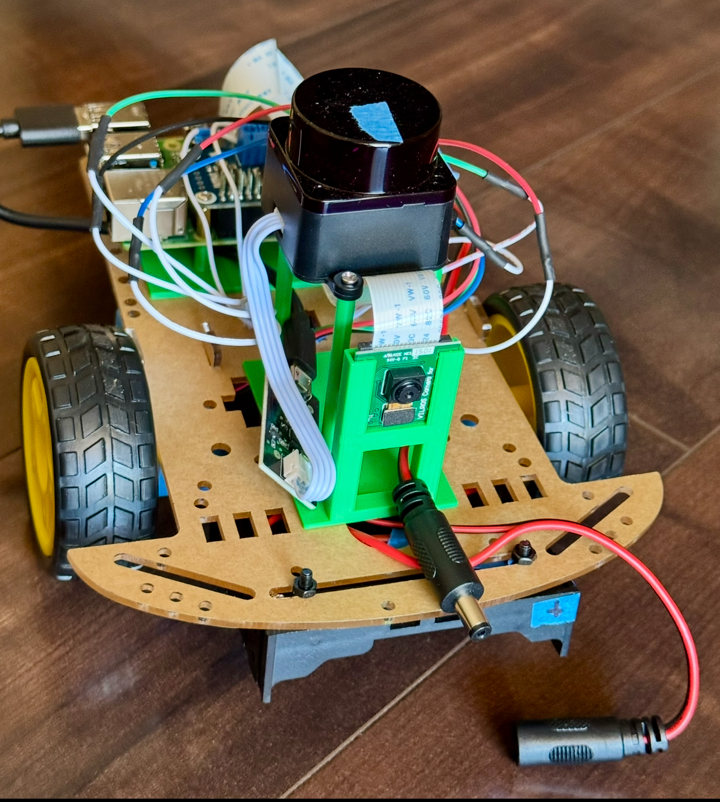

# Additional Bringup Guide

Some of the components have been changed from the original lidarbot. For example the Lidar has been changed to FHL-LD19 and the battery pack has been updated. To easily switch between external Battery Bench and Battery pack, male and female connectors are introduced to facilitate that. The ROS stack has been changed from Humble to Jazzy. Details are called out in this guide.

## Finished Differential Bot:

<div style="display: flex; gap: 20px; align-items: center;">
  <div>
    <h4>Top</h4>
    
  </div>
  <div>
    <h4>Bottom</h4>
    
  </div>
</div>

A few things:

-   If you're new to IMU or general soldering tasks, buy the ones with pins soldered. Improperly soldering will cause your Raspberry PI shuts down in a loop.

-   The smart car kit comes with a board which the holes are not so easy to mount all the parts. There are special set of 3D printed parts have been made. Find these files at [3D-stls](../3D-stls).

## Hardware Verification Checklist

Once you have mounted and wired all the components, the next task is to verify the hardware components are working. This section provides a set of steps to accomplish this.

-   [ ] **[RPi -> Driver Hat -> Motors](#rpi--driver-hat--motors)** - Verify motor connections and driver hat communication
-   [ ] **[RPi -> Driver Hat -> IMU (MPU6050)](#rpi--driver-hat--imu-mpu6050)** - Check I2C communication and sensor readings
-   [ ] **[RPi -> Lidar](#rpi--lidar)** - Test lidar sensor and data streaming
-   [ ] **[Power System](#power-system)** - Verify battery connections and voltage levels
-   [ ] **[RPi -> Camera Module](#camera-module)** - Test camera functionality
-   [ ] **[Wheel Encoders](#wheel-encoders)** - Verify encoder feedback and motor control

### RPi -> Driver Hat -> Motors {#rpi--driver-hat--motors}

Once you follow the [instructions](https://github.com/Juliaj/lidarbot/tree/jazzy?tab=readme-ov-file#lidarbot-setup) to setup the Raspberry Pi, to make sure PCA9685 is detected from Raspberry Pi, run following

```bash
sudo i2cdetect -y 1
```

The Driver Hat documentation and SDK files can be found [here](https://www.waveshare.com/wiki/Motor_Driver_HAT). Follow the Waveshare instruction page and download their demo app. The test scripts are in Python, make sure you create a venv first.

The `waveshare` Python script uses `smbus` which needs to be updated to `smbus2`. Another change made was to switch to the official https://github.com/WiringPi/WiringPi. The switching to the official WiringPi is due to the following error:

```
## Error
[ros2_control_node-6] [INFO] [1753839416.471676696] [LidarbotHardware]: Configuring motors and encoders...
[ros2_control_node-6] Oops: Unable to determine board revision from /proc/cpuinfo
[ros2_control_node-6]  -> No "Hardware" line
[ros2_control_node-6]  ->  You'd best google the error to find out why.
[spawner-7] [INFO] [1753839417.088210097] [spawner_imu_broadcaster]: waiting for service /controller_manager/list_controllers to become available...


[ros2_control_node-6] Oops: Unable to determine board revision from /proc/cpuinfo
[ros2_control_node-6]  -> No "Hardware" line
[ros2_control_node-6]  ->  You'd best google the error to find out why.
```

With the new WiringPi, there was a permission issue:

```
[ros2_control_node-5] wiringPiSetup: Unable to open /dev/mem or /dev/gpiomem: Permission denied.
[ros2_control_node-5]   Aborting your program because if it can not access the GPIO
[ros2_control_node-5]   hardware then it most certianly won't work
[ros2_control_node-5]   Try running with sudo?
```

The fix:

```bash
sudo nano /etc/udev/rules.d/99-gpio.rules

# add following
# KERNEL=="gpiomem", GROUP="gpio", MODE="0660"
# SUBSYSTEM=="gpio", GROUP="gpio", MODE="0660"
# SUBSYSTEM=="gpio*", PROGRAM="/bin/sh -c 'find -L /sys/class/gpio/ -maxdepth 2 -exec chown root:gpio {} \; -exec chmod 664 {} \;'"

# apply the rules
sudo udevadm control --reload-rules
sudo udevadm trigger

# inspect the permissions
ls -la /dev/gpiomem /dev/mem

groups $USER
id
# expected output:
# uid=1000(ubuntu) gid=1003(ubuntu) groups=1003(ubuntu),4(adm),20(dialout),24(cdrom),27(sudo),29(audio),44(video),46(plugdev),60(games),100(users),107(netdev),992(render),995(input),1000(gpio),1001(spi),1002(i2c)
```

1. Test motor rotation

```
# activate Python virtual environment
source venv/bin/activate

cd Motor_Driver_HAT_Code/Motor_Driver_HAT_Code/Raspberry\ Pi/python
python main.py
```

You should see motor moving. It may be helpful initially to remove all the wheels and put tapes on the motor to check on the direction. If the forward/backward motion is not as expected, rewire the motor.

2. Test Encoder
   To be added.

A helpful [post](https://pi3g.com/enabling-and-checking-i2c-on-the-raspberry-pi-using-the-command-line-for-your-own-scripts/) for checking I2C with Raspberry Pi. Good [starter troubleshooting doc](https://ubuntu.com/tutorials/gpio-on-raspberry-pi#1-overview) for I2C connections.

Knowledge tidbits:

**I2C** - i-squared-c or i-two-c. Inter-integrated circuit versus

-   IIC or I2C stand for Inter-Integrated circuit which means it should be used over short distance. IIC is a synchronous, multi-master/multi-slave, single-ended, serial communication bus invented in 1980 by Philips Semiconductors (now NXP Semiconductors)
-   CAN bus and I2C are both serial communication protocols, but they serve different purposes and have distinct characteristics. CAN bus is primarily used for robust, long-distance communication in automotive and industrial applications, while I2C is designed for shorter distances and is commonly used for communication between components on the same circuit board.
-   I2C and UART (a common type of serial communication) are both serial communication protocols, but they have different strengths and weaknesses. I2C is best for short-distance, multi-device communication on a single board or within a small system, while UART is better suited for longer distances and point-to-point connections.

```bash
sudo gpio readall

# additional i2c-tools
sudo apt-get install i2c-tools
```

[Good doc](https://www.totalphase.com/blog/2021/12/i2c-vs-spi-vs-uart-introduction-and-comparison-similarities-differences/) for comparing I2C, SPI and UART protocols.

### RPi -> Lidar {#rpi--lidar}

Find LD19 Lidar at [doc](https://wiki.youyeetoo.com/en/Lidar/D300), [additional software downloads](https://drive.google.com/drive/folders/1-7aiv9moeNkiL13mpPsgMKU4E2sX7BYs) where you can find the bottom plate diagram for 3D CAD design.

Note: The arrow on top of the FHL-LD19 lidar serves as a directional reference marker that indicates the 0-degree (zero-degree) direction for the sensor's coordinate system. The front of the sensor is designated as the zero-degree direction, and the rotation angle increases clockwise

If you are looking for additional tutorial: https://github.com/LudovaTech/lidar-LD19-tutorial.

To test the Lidar, on dev machine:

```bash
scp -r lidar_ros2_ws ubuntu@19x.x.x.xx:/home/ubuntu/lidar_ros2_ws

# Once rviz starts, load the config provided ($HOME/lidar_ros2_ws/src/ldlidar_stl_ros2-3.0.3/rviz2)
rviz2
```

on Raspberry Pi

```bash
cd lidar_ros2_ws/
source install/setup.bash

ros2 launch ldlidar_stl_ros2 ld19.launch.py
```

Move around the lidar and from Rviz, you should see the corresponding change from Lidar.

It may be tempting to find a Python script to stop the lidar from scanning, but after researching, this appears not possible at the moment. Someone posted this:

> The FHL-LD19 uses PWM control, not serial commands. You need to control a PWM pin (GPIO) instead of sending serial data. The motor starts/stops based on PWM duty cycle - typically 0% duty = stop, higher duty = running. Serial is only for data reading.

Some previous unsuccessful attempts:

```
pip install pyserial

# GPIO control requires root permissions to access hardware memory
sudo usermod -a -G gpio $USER

# log out and log back in

python ld19_op.py -a stop

# script runs fine, but radar still scanning.
```

It may not be easy to stop the lidar unless to cut the power, see https://forum.youyeetoo.com/t/ld19-external-speed-control/329/5.

## RPi -> Driver Hat -> IMU (MPU6050) {#rpi--driver-hat--imu-mpu6050}

Check whether the IMU is detected:

```bash
sudo i2cdetect -y 1
```

You should see something similar to:

```
     0  1  2  3  4  5  6  7  8  9  a  b  c  d  e  f
00:                         -- -- -- -- -- -- -- --
10: -- -- -- -- -- -- -- -- -- -- -- -- -- -- -- --
20: -- -- -- -- -- -- -- -- -- -- -- -- -- -- -- --
30: -- -- -- -- -- -- -- -- -- -- -- -- -- -- -- --
40: 40 -- -- -- -- -- -- -- -- -- -- -- -- -- -- --
50: -- -- -- -- -- -- -- -- -- -- -- -- -- -- -- --
60: -- -- -- -- -- -- -- -- 68 -- -- -- -- -- -- --
70: -- -- -- -- -- -- -- --
```

To calibrate MPU6050 offsets:

Please keep the MPU6050 module level and still. This may take a few minutes.

```bash
$ cd robot_ws
$ source install/setup.bash
$ ros2 run lidarbot_bringup mpu6050_offsets
```

Once you see following output:

```
Calculating offsets ...

Gyroscope offsets:
------------------
X: -486.782
Y: -127.995
Z: -79.0342

Accelerometer offsets:
----------------------
X: 32767.9
Y: -919.169
Z: -12079.1
```

Include the obtained offsets in the respective macros of the `mpu6050_lib.h` file. Then rebuild the package:

```
colcon build --symlink-install --packages-select lidarbot_bringup
```

To generate the variances:

```
ros2 run lidarbot_bringup mpu6050_covariances
```

Once you see output similar to the following:

```
Calculating variances ...

static_covariance_orientation: [2.37075e-06, 0.0, 0.0, 7.77565e-39, 0.0, 0.0, 9.83427e-11, 0.0, 0.0]
static_covariance_angular_velocity: [2.89216e-07, 0.0, 0.0, 3.19002e-07, 0.0, 0.0, 2.91161e-07, 0.0, 0.0]
static_covariance_linear_acceleration: [0, 0.0, 0.0, 0.000168326, 0.0, 0.0, 0.00111257, 0.0, 0.0]
```

Paste the covariance arrays in the `imu_broadcaster` `ros__parameters` section in `lidarbot_bringup/config/controllers.yaml`.

## RPi -> Camera module {#camera-module}

On Raspberry Pi:

```bash
sudo apt install libraspberrypi-bin v4l-utils raspi-config

# enable legacy camera
sudo raspi-config nonint do_legacy 0

#test
vcgencmd get_camera
```

If you see the following output, the camera module is good to go:

```
supported=1 detected=1, libcamera interfaces=0

```

To run usb_cam for Jazzy, at the time of this writing, the module is not available for Jazzy. You will need to build usb_cam for Jazzy.

```bash
git clone https://github.com/ros-perception/image_common -b jazzy
git clone https://github.com/ros-drivers/usb_cam

# colcon build both packages
```

To test the camera, you'll need `v4l2_camera` which you will need to build for Jazzy.

ros2 launch lidarbot_bringup camera_launch.py

[v4l2_camera_node-1] [INFO] [1756152876.124966009] [v4l2_camera]: Starting camera
[v4l2_camera_node-1] [WARN] [1756152876.596737697] [camera.v4l2_camera]: Image encoding not the same as requested output, performing possibly slow conversion: yuv422_yuy2 => rgb8
[v4l2_camera_node-1] [INFO] [1756152876.636561335] [camera.v4l2_camera]: using default calibration URL
[v4l2_camera_node-1] [INFO] [1756152876.636801519] [camera.v4l2_camera]: camera calibration URL: file:///home/ubuntu/.ros/camera_info/mmal_service_16.1.yaml
[v4l2_camera_node-1] [ERROR] [1756152876.637097814] [camera_calibration_parsers]: Unable to open camera calibration file [/home/ubuntu/.ros/camera_info/mmal_service_16.1.yaml]
[v4l2_camera_node-1] [WARN] [1756152876.637281850] [camera.v4l2_camera]: Camera calibration file /home/ubuntu/.ros/camera_info/mmal_service_16.1.yaml not found

Camera Calibration

Follow steps in https://automaticaddison.com/how-to-perform-pose-estimation-using-an-aruco-marker/

## RPi -> Gamepad for Teleop

First thing to check is the pairing. I have a PS4 game controller and the goal is to connect it to RPi via Bluetooth. Once you know the ropes, this is easy. At the beginning, it can be challenging.

```bash
# install Bluetooth utils
sudo apt  install bluez

sudo bluetoothctl
scan on
# press PS4 share + home to pair, the gamepad should start to blink after 3 seconds.
# look into the logs to find the New device Id mapping to the game controller, then ctrl-c exit
```

To make the pairing persistent:

```bash
# trust device
sudo bluetoothctl
trust 8C:41:F2:6B:1D:10

# enable auto start
sudo systemctl enable bluetooth

# Create udev rule for automatic permissions
sudo nano /etc/udev/rules.d/10-local.rules

# add following
# KERNEL=="js[0-9]*", MODE="0666"
# SUBSYSTEM=="input", ATTRS{name}=="*Controller*", MODE="0666"

sudo reboot
# after reboot, Controller should auto-connect when powered on (press PS home button).
```

To check whether the pairing is successful

```bash
ls /dev/input/
cat /proc/bus/input/devices | grep -A 5 "Wireless Controller"
```

To make the teleop work, the `twist_mux` needs to publish messages to `diff_controller/cmd_vel`. Note that `twist_mux` needs to be compiled on Raspberry Pi; see sections below for details.

A helpful utility to test the gamepad standalone and also identify the buttons:

```
ros2 run joy_tester test_joy
ros2 run joy joy_node
```

To test the path of ros2_control to the wheels:

```
ros2 topic pub --rate 10 /diff_controller/cmd_vel geometry_msgs/msg/TwistStamped "
  header: auto
  twist:
    linear:
      x: 0.7
      y: 0.0
      z: 0.0
    angular:
      x: 0.0
      y: 0.0
      z: 1.0"

```

## Missing Jazzy packages

[`robot_localization`](https://index.ros.org/p/robot_localization) is a package that supports [sensor fusion](https://automaticaddison.com/sensor-fusion-and-robot-localization-using-ros-2-jazzy/). Even though this package has a release for Jazzy, it doesn't seem to have one for ARM64 which we need for Raspberry Pi. Compiling it directly on Pi seems to hang at the following place:

```
[ 73%] Built target robot_localizationrosidl_generator_py
[ 74%] Built target robot_localization_srosidl_typesupport_fastrtps_c
[ 76%] Built target robot_localization_srosidl_typesupport_introspection_c
[ 77%] Built target robot_localization_srosidl_typesupport_c
```

Apparently, this is a known issue with ROS package compilation. Use the following command to build:

```bash
colcon build --packages-select robot_localization --parallel-workers 1 --executor sequential --cmake-args -DCMAKE_BUILD_TYPE=Release
```

The build hang issue may also be due to memory pressure. If you suspect it, run the following to make sure you have a sufficient size of swap file:

```
$ sudo swapon --show
NAME      TYPE SIZE USED PRIO
/swapfile file   8G   0B   -2

```

`twist_mux` supports geometry_msgs/Twist which diff_controller can use. This doesn't have a Jazzy release, so you will need to build it from https://github.com/ros-teleop/twist_mux.

To build `v4l2_camera`:

```bash
git clone https://gitlab.com/boldhearts/ros2_v4l2_camera.git
rosdep install --from-paths src/ros2_v4l2_camera --ignore-src -r -y
colcon build --symlink-install --packages-select v4l2_camera
```

## Additional Raspberry Pi Setup

### Sleep/SSH/WiFi drop

There were periods of time when the Raspberry Pi consistently became unresponsive after a very short time of no interaction, i.e., less than 5 minutes.
Here are some of the steps to fix this:

```bash
# following instruction from https://netplan.io/ to check whether power save is on:
iw dev wlan0 get power_save
Power save: on

# Disable power management
sudo iw dev wlan0 set power_save off
```

To make a permanent fix:

```bash
sudo tee /etc/udev/rules.d/70-wifi-powersave.rules << 'EOF'
# Disable power saving on WiFi interfaces
ACTION=="add", SUBSYSTEM=="net", KERNEL=="wlan*", RUN+="/sbin/iw dev $name set power_save off"
EOF

sudo udevadm control --reload-rules
```

Other methods (haven't tried):

```
# Enable SSH
sudo systemctl enable ssh

# Configure to wake on SSH connection attempt
# Add to /etc/ssh/sshd_config:
echo 'TCPKeepAlive yes' | sudo tee -a /etc/ssh/sshd_config
echo 'ClientAliveInterval 30' | sudo tee -a /etc/ssh/sshd_config
```

## Joy stick - dev machine

```bash
sudo dmesg

lsusb
# output: Bus 001 Device 010: ID 054c:05c4 Sony Corp. DualShock 4 [CUH-ZCT1x]

disconnect usb

sudo evtest (device 15)

# No device specified, trying to scan all of /dev/input/event*
# Available devices:
# /dev/input/event0:	Lid Switch
# /dev/input/event1:	Power Button
# /dev/input/event10:	Logitech USB Keyboard System Control
# /dev/input/event11:	Intel HID events
# /dev/input/event12:	HD-Audio Generic HDMI/DP,pcm=3
# /dev/input/event13:	HD-Audio Generic Mic
# /dev/input/event14:	HD-Audio Generic Headphone
# /dev/input/event15:	Wireless Controller
# /dev/input/event16:	Wireless Controller Motion Sensors
# /dev/input/event17:	Wireless Controller Touchpad
# /dev/input/event2:	AT Translated Set 2 keyboard
# /dev/input/event3:	PNP0C50:0b 0911:5288 Mouse
# /dev/input/event4:	PNP0C50:0b 0911:5288 Touchpad
# /dev/input/event5:	Video Bus
# /dev/input/event6:	Kingston HyperX Pulsefire Surge
# /dev/input/event7:	Kingston HyperX Pulsefire Surge Keyboard
# /dev/input/event8:	Logitech USB Keyboard
# /dev/input/event9:	Logitech USB Keyboard Consumer Control
```

## Scenario Tests

### SLAM

The first thing is to get a map. Change `mapper_params_online_async.yaml` to switch the model to `mapping`.

1. On RPi

```bash
cd robot_ws
ros2 launch lidarbot_bringup lidarbot_bringup_launch.py
```

2. On Dev machine
   Start slam_toolbox,

```bash
ros2 launch lidarbot_slam online_async_launch.py \
slam_params_file:=src/lidarbot_slam/config/mapper_params_online_async.yaml \
use_sim_time:=false
```

The slam_toolbox node is started in an unconfigured lifecycle state. You need to activate it first:

```bash
ros2 lifecycle set /slam_toolbox configure
ros2 lifecycle set /slam_toolbox activate
```

then start Rviz

```bash
cd lidarbot_ws
rviz2 -d src/lidarbot_slam/rviz/lidarbot_slam.rviz
```

If rviz2 reports the following, make sure `slam_toolbox` is configured and activated:

```
[INFO] [1756398335.798806392] [SlamToolboxPlugin]: Waiting for the slam_toolbox node configuration.
```

Once you have these started, you launch following on Raspberry Pi

```bash
ros2 launch lidarbot_bringup lidarbot_bringup_launch.py
```

And you see:

```
ros2_control_node-6] [WARN] [1756354982.227771759] [controller_manager]: Overrun detected! The controller manager missed its desired rate of 30 Hz. The loop took 34.143342 ms (missed cycles : 2).
```

This basically means the controller_manager can't keep up. It's unlikely an issue for `ros2_control`; rather we need to tweak some of the settings such as update frequency for the limited resources from Raspberry Pi.

You may be tempted to install a [low latency kernel](https://control.ros.org/rolling/doc/ros2_control/controller_manager/doc/userdoc.html). Good luck, this didn't work for me since the generic kernel doesn't have the correct files for RPi.

```
uname -r

# below shows optimized kernel for RPi
6.8.0-1032-raspi

```

Helpful commands to make sure the `topics` are receiving data:

```bash
ros2 topic hz /scan
ros2 topic hz /odom
ros2 run tf2_tools view_frames
```

To resolve the above issues, here are the changes tried:

-   Reduce the controller_manager update rate.
-   Increase controller manager priority\*\* if you see the following logs which show RT scheduling failed due to permissions.

```
[WARN] [1756409876.595781961] [controller_manager]: Could not enable FIFO RT scheduling policy: with error number <1>(Operation not permitted).
```

Follow instructions from https://control.ros.org/rolling/doc/ros2_control/controller_manager/doc/userdoc.html.

-   Reduce the read frequency from IMU. **Header file**: Added `last_read_time_` timestamp and `READ_INTERVAL_` constant (100ms = 10 Hz). **Source file**: Modified `read()` function to only call I2C functions every 100ms, using cached values otherwise
-   Reduce EKF update rate. From the log, the EKF node is struggling to maintain its update rate, taking 50-111ms when it should be faster. This is likely because the IMU and odometry data are overwhelming the filter. `src/lidarbot_navigation/config/ekf.yaml` -> frequency 30 to 15, then to 8
-   Reduce LD19 radar scan frequency. The frequency may be hard-coded, https://github.com/ldrobotSensorTeam/ldlidar_stl_ros2/blob/bf668a89baf722a787dadc442860dcbf33a82f5a/ldlidar_driver/src/filter/tofbf.cpp#L39, `scan_frequency_ = 4500`; this is likely to be 4.5Hz
